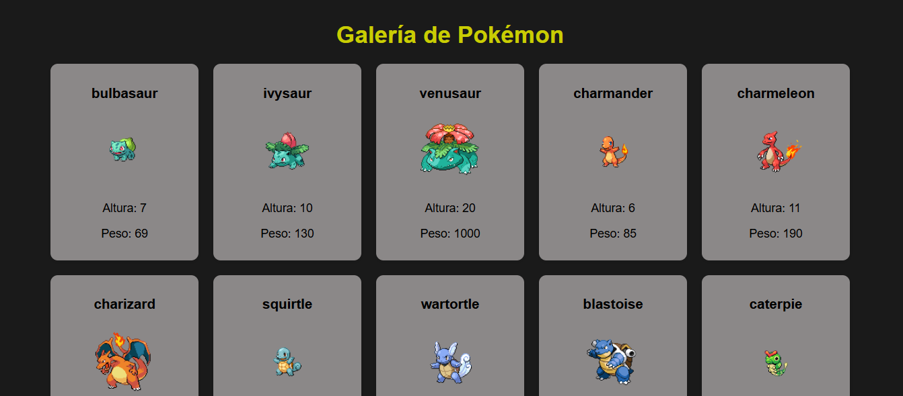
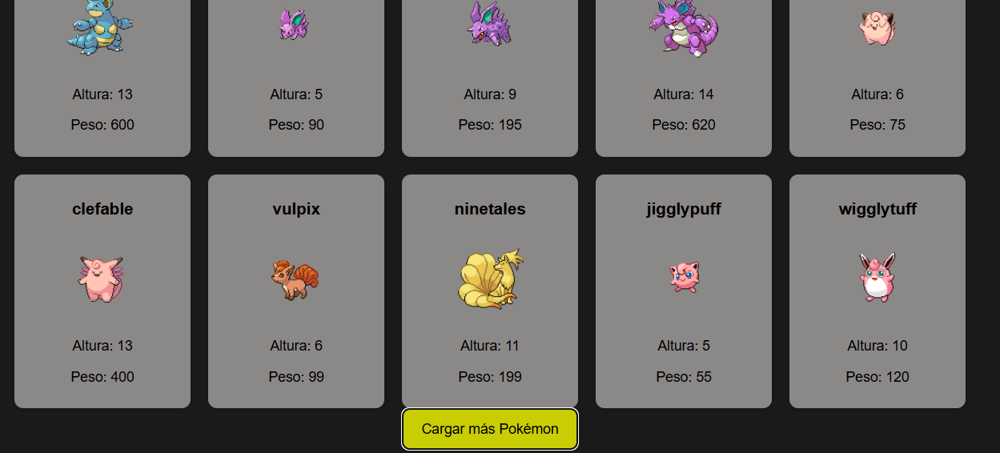

**Descripción del Proyecto**

El objetivo de este proyecto es practicar el consumo de APIs REST mediante JavaScript y la manipulación del DOM para mostrar datos de manera visual y atractiva.

Cada vez que el usuario presiona el botón “Cargar más”, se realiza una nueva solicitud a la API para mostrar más Pokémon, evitando recargas de página.

## API Utilizada

Se usa la [**PokéAPI oficial**](https://pokeapi.co/), un servicio gratuito que ofrece información detallada sobre todos los Pokémon existentes.

### Endpoints consumidos:

1. **Lista general de Pokémon**

   https://pokeapi.co/api/v2/pokemon?offset={offset}&limit={limit}

   Devuelve una lista con nombres y URLs de Pokémon.  
   Ejemplo: obtener los primeros 10 Pokémon →  
   `https://pokeapi.co/api/v2/pokemon?offset=0&limit=10`

2. **Detalles de cada Pokémon individual**

   https://pokeapi.co/api/v2/pokemon/{id}/
   Devuelve información completa del Pokémon, como:  
   •Imagen  
   •Altura  
   •Peso

## Instrucciones para ejecutar el proyecto

1. **Descargar o clonar el repositorio**

   bash
   git clone https://github.com/tu-usuario/pokeAPI.git

2. **Abrir el proyecto**

   - Extrae el contenido del archivo `.zip` o abre la carpeta del proyecto en **Visual Studio Code**.

3. **Abrir el archivo HTML**

   - Abre `index.html` en tu navegador o usa la extensión **Live Server** en VS Code.

4. **Explorar**
   - Verás los primeros Pokémon cargados automáticamente.
   - Haz clic en el botón **“Cargar más”** para ver nuevos Pokémon.

## Capturas de pantalla

